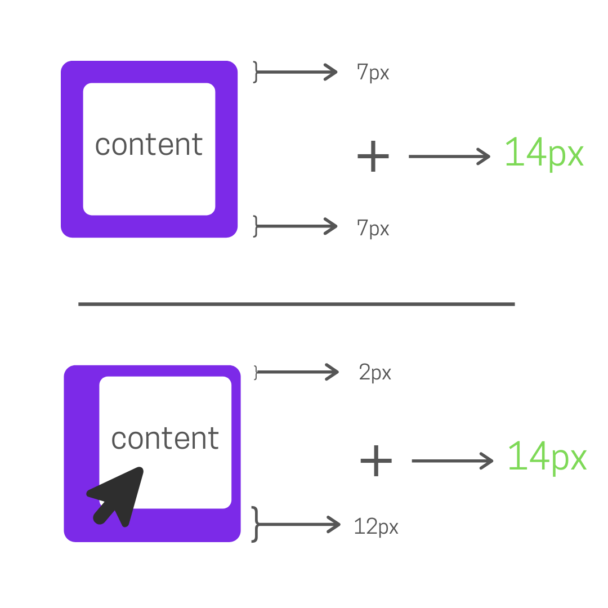

## The Why
The longer a webpage takes to load, the less likely your user is to engage with your content. Memory-intensive JavaScript animations eat up local resources, and make today’s websites unbearably slow. That’s why today we’re going to learn how to make this awesome colored shadow effect using only CSS! Lets jump into the markup.

## The Code
```html
   <div class="shadow-box">
       <div class="shadow-content">
           <h1>Bitwise</h1>
           <h3>Mouse over me!</h3>
       </div>
   </div>
```
The markup here is extremely simple, we have our content surrounded by two containers, one of which provides the shadow effect. Now let's get started with the CSS.
```css
.shadow-box{
    background: rgb(0,196,204);
    background: linear-gradient(90deg, rgba(0,196,204,1) 0%, rgba(124,42,232,1) 100%);
    border-radius: 5px;
}
 
.shadow-content{
    display: inline-block;
    width: 100%;
    background: #FFFFFF;
    height: 100%;
    box-sizing: border-box;
    padding: 10px;
    border-radius: 5px;
    margin: 0;
}
```
<style>
.shadow-box-1{
    background: rgb(0,196,204);
    background: linear-gradient(90deg, rgba(0,196,204,1) 0%, rgba(124,42,232,1) 100%);
    border-radius: 5px;
    margin: 0;
}
 
.shadow-content-1{
    display: inline-block;
    width: 100%;
    background: #FFFFFF;
    height: 100%;
    box-sizing: border-box;
    padding: 10px;
    border-radius: 5px;
    margin: 0;
}
</style>
<div class="shadow-box-1">
    <div class="shadow-content-1">
        <h1>Bitwise</h1>
        <h3>Mouse over me!</h3>
    </div>
</div>

The `shadow-box` container has a colored background - a gradient in this case - and the `shadow-content` container has a white background.
Right now, this just looks like black text on a white background, but that’s because both containers are the same size. If we give `shadow-box` some padding.

```css
.shadow-box{
    padding: 7px;
}
```
<style>
.shadow-box-2{
    background: rgb(0,196,204);
    background: linear-gradient(90deg, rgba(0,196,204,1) 0%, rgba(124,42,232,1) 100%);
    border-radius: 5px;
    padding: 7px;
    margin: 0;
}
 
.shadow-content-2{
    display: inline-block;
    width: 100%;
    background: #FFFFFF;
    height: 100%;
    box-sizing: border-box;
    padding: 10px;
    border-radius: 5px;
    margin: 0;
}
</style>
<div class="shadow-box-2">
    <div class="shadow-content-2">
        <h1>Bitwise</h1>
        <h3>Mouse over me!</h3>
    </div>
</div>

We see the colored shadow effect begin to take place. Now let's make this shadow interactive, by giving the content a raised look when the user hovers over the component.

```css
.shadow-box:hover{
    padding: 1px 1px 13px 13px;
    transition: 0.25s;
}
 
.shadow-box{
    transition: 0.25s;
}
```

<style>
.shadow-box-3{
    background: rgb(0,196,204);
    background: linear-gradient(90deg, rgba(0,196,204,1) 0%, rgba(124,42,232,1) 100%);
    border-radius: 5px;
    padding: 7px;
    transition: 0.25s;
    margin: 0;
}
.shadow-box-3:hover{
    padding: 1px 1px 13px 13px;
    transition: 0.25s;
}
.shadow-content-3{
    display: inline-block;
    width: 100%;
    background: #FFFFFF;
    height: 100%;
    box-sizing: border-box;
    padding: 10px;
    margin: 0;
    border-radius: 5px
}
</style>
<div class="shadow-box-3">
    <div class="shadow-content-3">
        <h1>Bitwise</h1>
        <h3>Mouse over me!</h3>
    </div>
</div>

The padding values that I chose here for the two states of the shadow - 7px and 1px / 13px, are what I think look best, but you can make them whatever you want. It’s very important to note, however, that the total vertical padding must be equal in the two states of the shadow.



With that, we’re all done. Happy designing!

